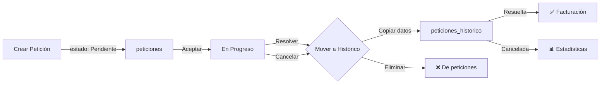

# 📊 SISTEMA DE TRAZABILIDAD COMPLETO

## 🎯 Descripción General

El sistema de trazabilidad asegura que **TODAS las peticiones** sean rastreables, estén activas o completadas. Esto permite ver estadísticas completas, costos totales y el historial completo de trabajo.

---

## 🗂️ Arquitectura de Base de Datos

### **Dual-Table Pattern** (Patrón de Dos Tablas)

```
┌─────────────────┐         ┌──────────────────────┐
│   PETICIONES    │         │ PETICIONES_HISTORICO │
│   (Activas)     │  ─────> │   (Completadas)      │
└─────────────────┘         └──────────────────────┘
  ┌───────────┐                 ┌────────────┐
  │ Pendiente │                 │  Resuelta  │
  │En Progreso│                 │ Cancelada  │
  └───────────┘                 └────────────┘
```

### **1. Tabla `peticiones` (Activas)**

Almacena peticiones que aún están **en proceso**:

- **Estados permitidos:**
  - `Pendiente` - Esperando ser asignada
  - `En Progreso` - Asignada a un usuario

**Características:**
- ✅ Datos en tiempo real
- ✅ Permite edición
- ✅ Alertas de vencimiento activas
- ✅ WebSocket para notificaciones

### **2. Tabla `peticiones_historico` (Completadas)**

Almacena peticiones **finalizadas**:

- **Estados permitidos:**
  - `Resuelta` - Completada exitosamente
  - `Cancelada` - Cancelada por algún motivo

**Características:**
- ✅ Datos inmutables (no se pueden editar)
- ✅ Conserva toda la información original
- ✅ Incluye `fecha_resolucion`
- ✅ Base para estadísticas y facturación

---

## 🔄 Flujo de Vida de una Petición



### **Paso a Paso:**

#### **1. Creación (Estado: Pendiente)**
```typescript
// POST /api/peticiones
{
  cliente_id: 1,
  categoria_id: 2,
  descripcion: "Crear banner",
  costo: 50000,
  estado: "Pendiente"
}
```
- ✅ Se guarda en tabla `peticiones`
- ✅ Visible para usuarios del área correspondiente

#### **2. Aceptación (Estado: En Progreso)**
```typescript
// POST /api/peticiones/:id/aceptar
```
- ✅ Actualiza `estado` a "En Progreso"
- ✅ Asigna `asignado_a` con el usuario actual
- ✅ Establece `fecha_aceptacion`
- ✅ Sigue en tabla `peticiones`

#### **3. Resolución (Estado: Resuelta) 🔑 PUNTO CRÍTICO**
```typescript
// PATCH /api/peticiones/:id/estado
{
  estado: "Resuelta"
}
```

**Backend ejecuta:**
```typescript
// 1. Actualizar fecha_resolucion
peticion.fecha_resolucion = new Date();
await peticion.save();

// 2. Copiar a histórico
await PeticionHistorico.create({
  peticion_id_original: peticion.id,
  cliente_id: peticion.cliente_id,
  categoria_id: peticion.categoria_id,
  descripcion: peticion.descripcion,
  costo: peticion.costo,
  estado: "Resuelta",
  creador_id: peticion.creador_id,
  asignado_a: peticion.asignado_a,
  fecha_creacion: peticion.fecha_creacion,
  fecha_aceptacion: peticion.fecha_aceptacion,
  fecha_limite: peticion.fecha_limite,
  fecha_resolucion: peticion.fecha_resolucion,
  tiempo_limite_horas: peticion.tiempo_limite_horas
});

// 3. Eliminar de activas
await peticion.destroy();
```

- ✅ La petición **desaparece** de `peticiones`
- ✅ Aparece en `peticiones_historico` con estado "Resuelta"
- ✅ **IMPORTANTE:** ¡No se pierde! Solo cambia de tabla

#### **4. Cancelación (Estado: Cancelada)**
```typescript
// PATCH /api/peticiones/:id/estado
{
  estado: "Cancelada"
}
```
- ✅ Mismo proceso que "Resuelta"
- ✅ Se mueve a `peticiones_historico` con estado "Cancelada"

---

## 📊 Sistema de Estadísticas

### **Cálculo Correcto de Estadísticas**

**❌ INCORRECTO:**
```typescript
// Solo cuenta peticiones activas
const total = await Peticion.count({ where: { usuario_id } });
```
**Problema:** Ignora las peticiones que ya fueron resueltas/canceladas

**✅ CORRECTO:**
```typescript
// Cuenta peticiones activas + históricas
const activasCount = await Peticion.count({ 
  where: { creador_id: usuario_id } 
});

const historicasCount = await PeticionHistorico.count({ 
  where: { creador_id: usuario_id } 
});

const total = activasCount + historicasCount;
```

### **Implementación en `estadistica.service.ts`**

```typescript
async calcularEstadisticasUsuario(usuario_id: number, año: number, mes: number) {
  const fechaInicio = new Date(año, mes - 1, 1);
  const fechaFin = new Date(año, mes, 0, 23, 59, 59);

  // 1️⃣ Peticiones CREADAS (activas + históricas)
  const peticiones_creadas_activas = await Peticion.count({
    where: {
      creador_id: usuario_id,
      fecha_creacion: { [Op.between]: [fechaInicio, fechaFin] }
    }
  });

  const peticiones_creadas_historico = await PeticionHistorico.count({
    where: {
      creador_id: usuario_id,
      fecha_creacion: { [Op.between]: [fechaInicio, fechaFin] }
    }
  });

  const peticiones_creadas = peticiones_creadas_activas + peticiones_creadas_historico;

  // 2️⃣ Peticiones RESUELTAS (solo históricas)
  const peticiones_resueltas = await PeticionHistorico.count({
    where: {
      asignado_a: usuario_id,
      estado: "Resuelta",
      fecha_resolucion: { [Op.between]: [fechaInicio, fechaFin] }
    }
  });

  // 3️⃣ Peticiones CANCELADAS (solo históricas)
  const peticiones_canceladas = await PeticionHistorico.count({
    where: {
      asignado_a: usuario_id,
      estado: "Cancelada",
      fecha_resolucion: { [Op.between]: [fechaInicio, fechaFin] }
    }
  });

  // 4️⃣ Tiempo promedio de resolución (solo históricas resueltas)
  const peticionesConTiempo = await PeticionHistorico.findAll({
    where: {
      asignado_a: usuario_id,
      estado: "Resuelta",
      fecha_resolucion: { [Op.between]: [fechaInicio, fechaFin] }
    },
    attributes: [
      "fecha_aceptacion",
      "fecha_resolucion"
    ]
  });

  let tiempo_promedio_resolucion_horas = 0;
  if (peticionesConTiempo.length > 0) {
    const tiempos = peticionesConTiempo.map((p) => {
      const inicio = new Date(p.fecha_aceptacion!).getTime();
      const fin = new Date(p.fecha_resolucion!).getTime();
      return (fin - inicio) / (1000 * 60 * 60); // Horas
    });
    tiempo_promedio_resolucion_horas = tiempos.reduce((a, b) => a + b, 0) / tiempos.length;
  }

  // 5️⃣ Costo total generado (solo históricas resueltas)
  const resultadoCosto = await PeticionHistorico.findOne({
    where: {
      asignado_a: usuario_id,
      estado: "Resuelta",
      fecha_resolucion: { [Op.between]: [fechaInicio, fechaFin] }
    },
    attributes: [
      [sequelize.fn("SUM", sequelize.col("costo")), "total"]
    ],
    raw: true
  });

  const costo_total_generado = Number(resultadoCosto?.total || 0);

  return {
    peticiones_creadas,      // Total (activas + históricas)
    peticiones_resueltas,    // Solo históricas con estado="Resuelta"
    peticiones_canceladas,   // Solo históricas con estado="Cancelada"
    tiempo_promedio_resolucion_horas,
    costo_total_generado
  };
}
```

---

## 🎯 Endpoints Disponibles

### **1. Estadísticas de Usuario**
```http
GET /api/estadisticas/mis-estadisticas?año=2024&mes=1
```

**Respuesta:**
```json
{
  "success": true,
  "data": [
    {
      "id": 1,
      "usuario_id": 5,
      "año": 2024,
      "mes": 1,
      "peticiones_creadas": 25,      // ✅ Activas + Históricas
      "peticiones_resueltas": 18,    // ✅ Solo históricas
      "peticiones_canceladas": 2,
      "tiempo_promedio_resolucion_horas": 12.5,
      "costo_total_generado": 750000
    }
  ]
}
```

### **2. Estadísticas Globales (Admin)**
```http
GET /api/estadisticas/globales?año=2024&mes=1
```

**Respuesta:**
```json
{
  "success": true,
  "data": {
    "totales": {
      "total_peticiones_creadas": 150,
      "total_peticiones_resueltas": 120,
      "total_peticiones_canceladas": 10,
      "total_costo_generado": 5000000,
      "promedio_tiempo_resolucion": 15.3
    },
    "por_area": [
      {
        "area": "Diseño",
        "peticiones_creadas": 80,
        "peticiones_resueltas": 65,
        "costo_total": 3000000
      },
      {
        "area": "Pautas",
        "peticiones_creadas": 70,
        "peticiones_resueltas": 55,
        "costo_total": 2000000
      }
    ]
  }
}
```

### **3. Estadísticas por Área**
```http
GET /api/estadisticas/area/Diseño?año=2024&mes=1
```

---

## 🚨 Puntos Críticos para Desarrolladores

### **⚠️ NO hacer:**

```typescript
// ❌ INCORRECTO - Solo cuenta activas
const total = await Peticion.count({ where: { usuario_id } });

// ❌ INCORRECTO - No incluye históricas
const resueltas = await Peticion.count({ 
  where: { estado: "Resuelta" } 
}); // Siempre será 0
```

### **✅ SÍ hacer:**

```typescript
// ✅ CORRECTO - Cuenta activas + históricas
const activas = await Peticion.count({ where: { creador_id } });
const historicas = await PeticionHistorico.count({ where: { creador_id } });
const total = activas + historicas;

// ✅ CORRECTO - Las resueltas SOLO están en histórico
const resueltas = await PeticionHistorico.count({ 
  where: { estado: "Resuelta", asignado_a: usuario_id } 
});
```

---

## 📈 Dashboard de Usuario

### **Implementación Correcta**

```typescript
// Front: dashboard-usuario.component.ts
ngOnInit() {
  const fecha = new Date();
  
  // Obtener estadísticas (backend ya calcula correctamente)
  this.estadisticaService
    .getMisEstadisticas(fecha.getFullYear(), fecha.getMonth() + 1)
    .subscribe({
      next: (response) => {
        if (response.success && response.data.length > 0) {
          this.misEstadisticas = response.data[0];
          // ✅ peticiones_creadas incluye activas + históricas
          // ✅ peticiones_resueltas incluye solo históricas
          // ✅ tiempo_promedio_resolucion_horas calculado correctamente
        }
      }
    });
}
```

### **Template**
```html
<p-card>
  <div class="estadisticas">
    <div class="stat">
      <h3>{{ misEstadisticas?.peticiones_creadas || 0 }}</h3>
      <p>Total Creadas</p>
      <small>Incluye activas e históricas</small>
    </div>

    <div class="stat">
      <h3>{{ misEstadisticas?.peticiones_resueltas || 0 }}</h3>
      <p>Resueltas</p>
      <small>✅ Completadas exitosamente</small>
    </div>

    <div class="stat">
      <h3>{{ misEstadisticas?.peticiones_canceladas || 0 }}</h3>
      <p>Canceladas</p>
    </div>

    <div class="stat">
      <h3>{{ misEstadisticas?.tiempo_promedio_resolucion_horas | number:'1.1-1' }}h</h3>
      <p>Tiempo Promedio</p>
    </div>

    <div class="stat">
      <h3>{{ misEstadisticas?.costo_total_generado | currency:'COP':'symbol-narrow':'1.0-0' }}</h3>
      <p>Costo Total Generado</p>
    </div>
  </div>
</p-card>
```

---

## 🔍 Consultas Útiles SQL

### **Ver todas las peticiones de un usuario (activas + históricas)**
```sql
-- Activas
SELECT * FROM peticiones WHERE creador_id = 5;

-- Históricas
SELECT * FROM peticiones_historico WHERE creador_id = 5;

-- Total
SELECT COUNT(*) FROM (
  SELECT id FROM peticiones WHERE creador_id = 5
  UNION ALL
  SELECT id FROM peticiones_historico WHERE creador_id = 5
) AS total;
```

### **Ver peticiones resueltas por un usuario**
```sql
SELECT 
  ph.*,
  c.nombre AS cliente,
  cat.nombre AS categoria
FROM peticiones_historico ph
INNER JOIN clientes c ON ph.cliente_id = c.id
INNER JOIN categorias cat ON ph.categoria_id = cat.id
WHERE ph.asignado_a = 5
  AND ph.estado = 'Resuelta'
  AND ph.fecha_resolucion BETWEEN '2024-01-01' AND '2024-01-31'
ORDER BY ph.fecha_resolucion DESC;
```

---

## ✅ Checklist de Verificación

Al implementar nuevas funcionalidades que usen peticiones, verifica:

- [ ] ¿Consultas tanto `peticiones` como `peticiones_historico`?
- [ ] ¿Sumas correctamente los totales?
- [ ] ¿Usas `fecha_resolucion` del histórico para estadísticas?
- [ ] ¿Filtras por estado correctamente? (Resuelta/Cancelada solo en histórico)
- [ ] ¿Muestras el tiempo de resolución solo de peticiones históricas?
- [ ] ¿El dashboard muestra 0 en resueltas? → Verifica que consulte `peticiones_historico`

---

## 🎓 Resumen Final

### **Reglas de Oro:**

1. **Peticiones activas** → Tabla `peticiones` (Pendiente, En Progreso)
2. **Peticiones completadas** → Tabla `peticiones_historico` (Resuelta, Cancelada)
3. **Totales** = Activas + Históricas
4. **Resueltas/Canceladas** = SOLO Históricas
5. **Estadísticas** = SIEMPRE consultar ambas tablas
6. **Facturación** = SOLO de peticiones en `peticiones_historico` con estado "Resuelta"

### **Flujo Visual:**

```
CREAR → [peticiones] Pendiente
         ↓
      ACEPTAR
         ↓
[peticiones] En Progreso
         ↓
      RESOLVER / CANCELAR
         ↓
[peticiones_historico] Resuelta/Cancelada
         ↓
   ESTADÍSTICAS + FACTURACIÓN
```

---

**✅ Con este sistema, NUNCA se pierde trazabilidad de las peticiones.**
